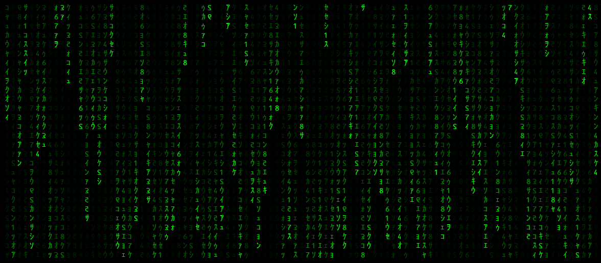

# Matrix Rain Effect in C# with WPF

A lightweight WPF UserControl that simulates the iconic Matrix "digital rain" effect using `DrawingVisual` for efficient rendering.

My original post on [codeproject](https://www.codeproject.com/Articles/5164199/Matrix-Style-Rain-in-Csharp-with-WPF)

## ✨ Features

- Customizable frame rate, font, size, colors, and character set  
- Smooth animation using `DrawingVisual` and `WriteableBitmap`  
- Lightweight and efficient rendering without layout or input overhead  
- Start/Stop controls and color customization  

## 📸 Preview

 <!-- Replace with your actual image path -->

## 🛠️ Getting Started

### Prerequisites

- .NET Framework 4.5 or higher  
- Visual Studio or other WPF-compatible development environment  

### Installation

```bash
git clone https://github.com/yourusername/MatrixRainWPF.git
```

## ⚠️ Font License Notice
You can find the embedded font here: [Matrix Code NFI](https://www.1001fonts.com/matrix-code-nfi-font.html).  

This font is free for personal use only.
